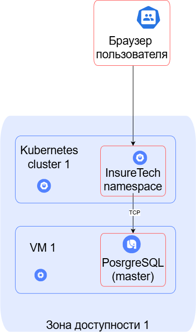
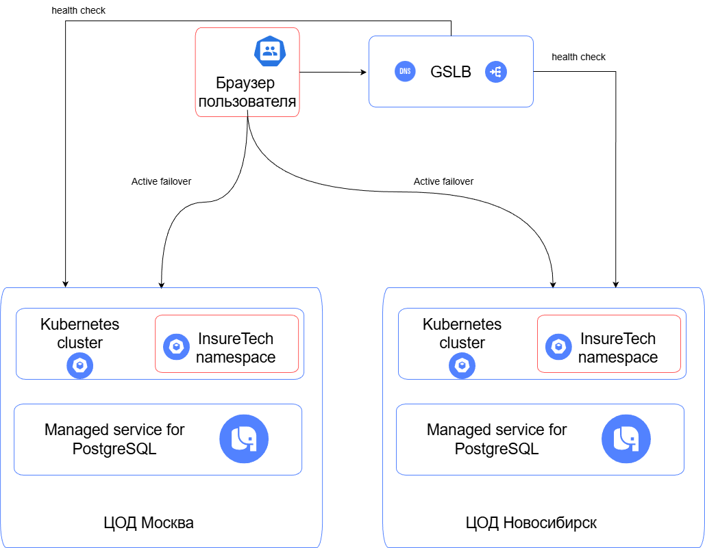

Основные нефункциональные требования бизнеса:

- Нужно обеспечить бесперебойную работу сервиса 24/7, при этом сервис должен обслуживать 
клиентов из всех часовых поясов. 
- Доступность приложения должна быть равна 99,9% и нужно обеспечить одинаковое время загрузки страниц 
для пользователей из разных регионов. 
- Требования к отказоустойчивости: RTO — 45 мин., RPO — 15 мин.

Учитывая вышеперечисленное, предлагается развернуть приложение в нескольких дата центрах Yandex Cloud, 
расположенных в разных регионах страны (например, Москва, Санкт-Петербург, Новосибирск). 
В каждом регионе развертываем независимый Kubernetes кластер и используем фейловер-стратегию 
Active-Active с георезервированием. За маршрутизацию трафика между дата-центрами будет отвечать DNS 
и балансировщик GSLB.

Чтобы решить проблемы готовности сервиса к увеличению числа пользователей воспользуемся механизмами 
автоматического масштабирования Kubernetes, чтобы оптимизировать расход ресурсов.

Внутри каждого Kubernetes кластера будем использовать горизонтальное масштабирование 
c помощью Horizontal Pod Autoscaler. Этот способ больше всего подходит под наше приложение 
поскольку наше приложение легко горизонтально масштабируется (не имеет состояния) 
и не содержит ресурсоёмких задач. При этом важно понимать, что уровень активности пользователей 
в пиковые часы может значительно отличаться от минимального и даже среднего. 
Поэтому для ещё большей оптимизации используемых ресурсов будем применять Cluster Autoscaler, 
чтобы в ночные часы ресурсы кластера не расходовались понапрасну.

Для развертывания базы данных будем использовать Managed service for PostgreSQL. 
Репликация между зонами доступности будет осуществляться автоматически, сервис предоставляет 
кворумную репликацию. Учитывая относительно небольшой объем данных 50 GB на начальном этапе 
обойдёмся без шардирования. Сервис поддерживает механизм Point-in-Time Recovery (PITR), 
который позволяет восстановить состояние кластера на любой момент за последние 7 дней. 
Резервное копирование осуществляется с использованием утилиты WAL-G, 
которая работает с Write‑Ahead Log (WAL) и позволяет создавать полные и инкрементальные бэкапы.

## Существующая архитектура

## Проектируемая архитектура
