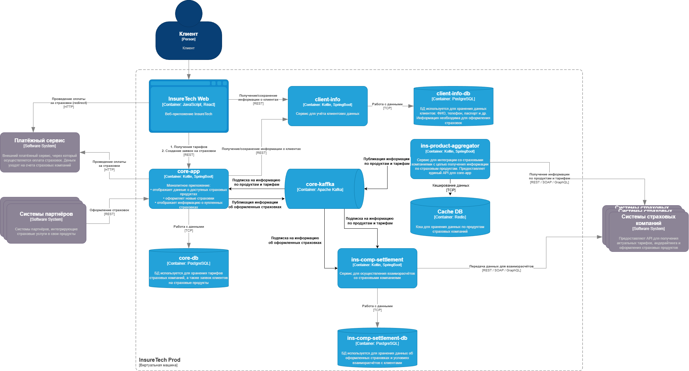

Сервисы core-app и ins-comp-settlement получают данные о доступных продуктах через REST API сервиса ins-product-aggregator. В момент вызова он:
- запрашивает информацию из всех страховых компаний (сейчас их пять),
- агрегирует её в единый список,
- возвращает этот список в рамках того же синхронного запроса.
Таким образом сейчас взаимодействие между сервисами построено с использованием синхронных запросов. Несмотря на то, что команда решила хранить локальные реплики данных о продуктах и тарифах в сервисах core-app и ins-comp-settlement, синхронное взаимодействие между сервисами накладывает ряд ограничений и может приводить к проблемам. 

Среди них:
- Ошибки взаимодействия между этими сервисами, которые связаны с задержками ответов или ошибками при взаимодействии с API страховых компаний.
- Из-за синхронного взаимодействия при росте нагрузки на сервис интеграции со страховыми компаниями пропорционально растёт нагрузка и на системы страховых компаний. Работоспособность нашего сервиса жестко завязана на сторонние системы. 
- Отказоустойчивость нашего сервиса завязана на сторонние системы. При росте количества этих систем, отказоустойчивость нашего сервиса ухудшается.
- При увеличении количества систем страховых компаний растет вероятность ошибок и задержек при взаимодействии с API, что сказывается на увеличении общего времени выполнения синхронного запроса к ins-product-aggregator.
- Время обработки запросов также растёт из-за суммарного времени на взаимодействия.

В качестве решения предлагается перейти на Event-Driven архитектуру, а именно внедрить асинхронное взаимодействие между сервисами: core-app, ins-comp-settlement и ins-product-aggregator. 

Плюсы после перехода:
- Уменьшение зависимости между компонентами системы снижает риск сбоев всей системы из-за отказа одного из них.
- Упрощение горизонтального масштабирования благодаря асинхронному взаимодействию между компонентами системы.
- Благодаря немедленной реакции на события система может обрабатывать данные почти в реальном времени.
- Каждый компонент фокусируется на своих задачах и отвечает за генерацию конкретных событий. Это уменьшает необходимость в прямом взаимодействии между сервисами.

В качестве брокера данных добавляем Apache Kafka. Взаимодействия между сервисами core-app, ins-comp-settlement и ins-product-aggregator будут происходить через топики.

Сервис для интеграции со страховыми компаниями с целью получения информации по их продуктам сохранит схему взаимодействия с компаниями, но запросы к ним будет отправлять по расписанию (раз в 15 минут), сохранять результаты в локальном кэше Redis и публиковать изменения в топик Apache Kafka.

Сервисы core-app и ins-comp-settlement будут подписчиками топика по продуктам страховых компаний. Они будут обновлять локальные реплики с данными на основе событий, получаемых из сервиса-агрегатора данных.

Сервис core-app будет публиковать информацию об оформленных страховках в отдельный топик Apache Kafka, подписчиком которого станет сервис ins-comp-settlement. На стороне core-app мы воспользуемся паттерном Transactional Outbox, чтобы избежать двойной записи при работе со взаиморасчётами.

Такой подход позволяет решить сразу несколько проблем:

- Разрыв синхронной связи между сервисами, что повышает отказоустойчивость приложения в целом, так как недоступность одного из сервисов не вызывает полного или частичного отказа его потребителей.
- Снижение времени отклика на операции, в рамках которых ранее выполнялись запросы к сторонним сервисам страховых компаний. 
- Благодаря использованию реплик данных о продуктах страховых компаний синхронные запросы в сервис-агрегатор больше не требуются. Благодаря асинхронной обработке вся информация о продуктах поступает в событиях.
- Отказ от синхронных запросов по времени в приложениях core-app и ins-comp-settlement снижает нагрузку на эти приложения и экономит их ресурсы.

